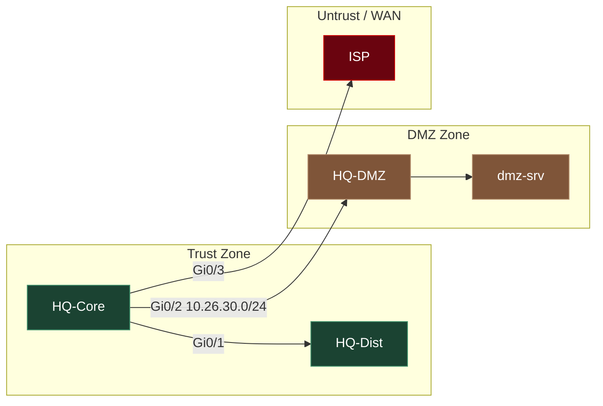

# 構成図規約

ネットワーク物理構成図・論理構成図の作成方式を定義する。**Mermaid第一の原則**を採用する。

## 1. Mermaid第一の原則

| 項目 | 規約 |
|---|---|
| ソースファイル | `02_基本設計/ネットワーク物理構成図.mermaid` |
| README埋め込み | README_Lab_Challenge.md の「トポロジ」章に ```` ```mermaid ```` コードブロックで直接埋め込む |
| 根拠 | GitHub がMermaidコードブロックをネイティブ描画する（追加ツール・ビルド不要でリポジトリ上にそのまま図が見える） |

- 物理構成図は必ずMermaidで作成する。drawio等のバイナリ形式を新規の一次ソースにしない。
- README内の埋め込みとファイル単体（`.mermaid`）は同一内容を保つ（差分が出たら`.mermaid`側を正とし、READMEに再埋め込みする）。

## 2. ゾーン表現

セキュリティゾーン（Trust / DMZ / Untrust / WAN等）は `subgraph` で色分け表現する。テーマ26のHTML構成図が採用したゾーン概念とMermaid側でも対応させる。



- ゾーンごとに `classDef` で色を固定し、テーマ間で同じゾーンには同じ配色を使う（Trust=緑系、DMZ=橙系、Untrust/WAN=赤系を既定とする）。
- ゾーンをまたぐリンクにはインターフェース名・サブネットをラベルとして付ける（§5参照）。

## 3. 詳細・印刷版HTML（許容パターン）

- 詳細な配線図・印刷向けレイアウトが必要な場合のみ、手作りHTMLを `02_基本設計/ネットワーク構成図.html` として許容する（テーマ26 [ネットワーク構成図.html](../26_dynamic_routing_deep_dive/02_基本設計/ネットワーク構成図.html) 方式）。
- 位置づけは **Mermaidの補助**。Mermaid図が一次情報、HTMLは詳細版・印刷版という上下関係を崩さない。
- このHTMLは `規約/ビルド/build.mjs` の自動生成対象ではない（手作りのため手編集を許容する例外）。[ドキュメント標準.md](ドキュメント標準.md) §5参照。

## 4. drawio方針

| 項目 | 規約 |
|---|---|
| 新規作成 | **非推奨**。新規テーマでdrawioを一次ソースにしない |
| 非推奨の理由 | バイナリ同然のXML圧縮形式でgit差分が実質不能。GitHub上でネイティブ描画されない（画像化しないと見えない） |
| 既存資産（テーマ22） | 残置する。遡及移行はしない（[README.md](README.md) の適用範囲方針に準拠） |

## 5. Mermaid記法の統一ルール

| 項目 | 規約 |
|---|---|
| 方向指定 | 階層構造（コア→ディストリ→エッジ等の縦の関係）は `graph TB`。拠点間・左右の接続関係は `graph LR` |
| ノードID | ノードIDはclab.ymlのノード名と一致させる（例: `hq-core`, `hq-dist`）。表示ラベルは `hq-core[HQ-Core]` のように大文字化・略称展開して見やすくする |
| リンクラベル | ゾーン間・拠点間リンクには **IF名 と サブネット** を `-->|Gi0/1 10.26.10.0/24|` の形式で付与する。同一ゾーン内の細かいリンクは省略可 |
| サブグラフID | `subgraph <英語ID>["<表示名>"]` の形式。IDはゾーン名の英語表記（Trust/DMZ/Untrust/WAN） |
| ノード数が多い場合 | 拠点単位でsubgraphを分け、拠点内はTB・拠点間はLRのように混在させてよい |

## 6. 参照

- [ドキュメント標準.md](ドキュメント標準.md) — README必須章「トポロジ」の定義
- [clab運用規約.md](clab運用規約.md) — ノード命名・mgmt-ipv4規約（構成図のノードIDと一致させる対象）
